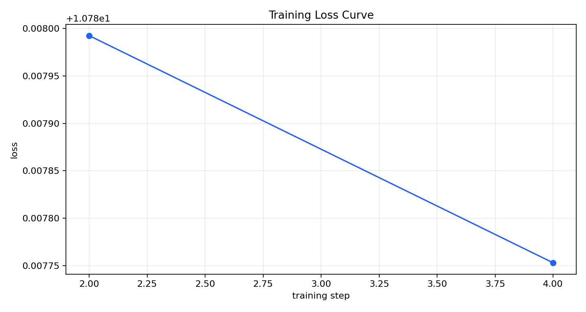
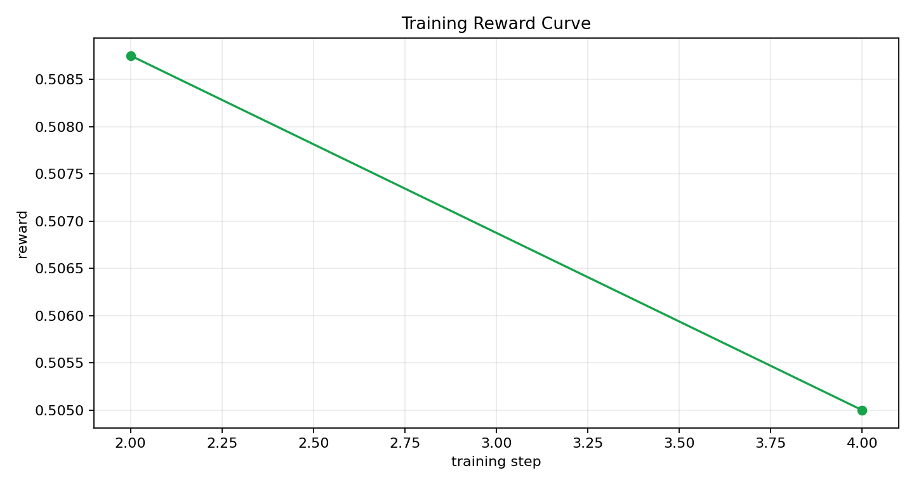

# Training Evidence Report

This report was auto-generated from a real environment-connected training run.

## Run Info

- Run directory: `artifacts\automation_check`
- Total updates: `2`
- Final training step: `4`

## Metric Summary

- Initial loss: `10.787992`
- Final loss: `10.787753`
- Loss change (final - initial): `-0.000239`
- Best (lowest) loss: `10.787753` at step `4`

- Initial avg reward: `0.508750`
- Final avg reward: `0.505000`
- Reward change (final - initial): `-0.003750`
- Best avg reward: `0.508750` at step `2`

## Curves

Loss curve (x-axis: `training step`, y-axis: `loss`):

Reward curve (x-axis: `training step`, y-axis: `reward`):

## Raw Metrics

Source file: `training_metrics.csv`
