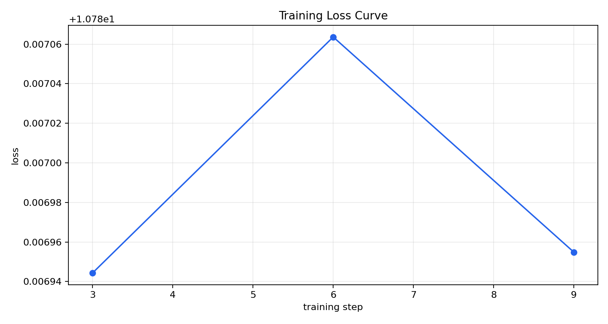
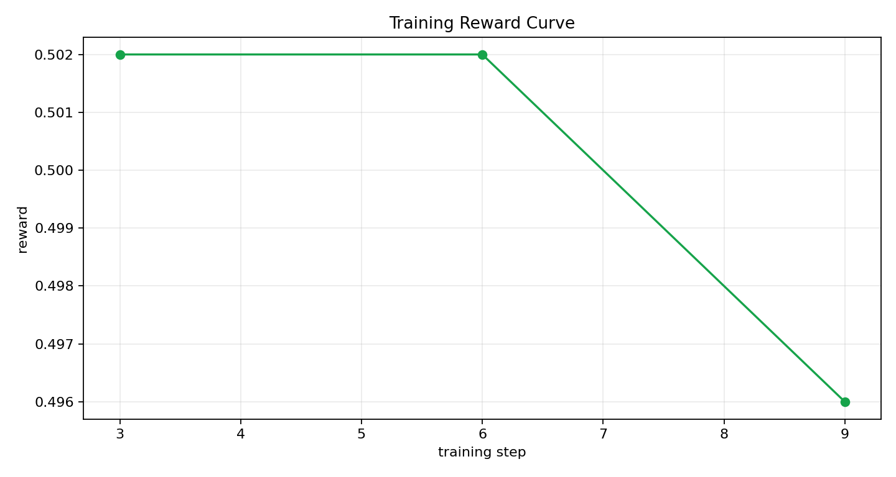

# Training Evidence Report

This report was auto-generated from a real environment-connected training run.

## Run Info

- Run directory: `artifacts\training_optional_improved`
- Total updates: `3`
- Final training step: `9`

## Metric Summary

- Initial loss: `10.786944`
- Final loss: `10.786955`
- Loss change (final - initial): `0.000011`
- Best (lowest) loss: `10.786944` at step `3`

- Initial avg reward: `0.502000`
- Final avg reward: `0.496000`
- Reward change (final - initial): `-0.006000`
- Best avg reward: `0.502000` at step `3`

## Curves

Loss curve (x-axis: `training step`, y-axis: `loss`):

Reward curve (x-axis: `training step`, y-axis: `reward`):

## Raw Metrics

Source file: `training_metrics.csv`
