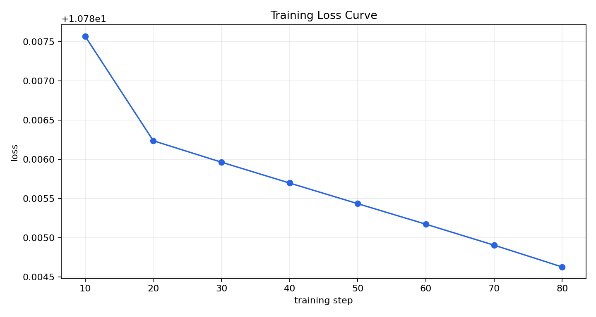
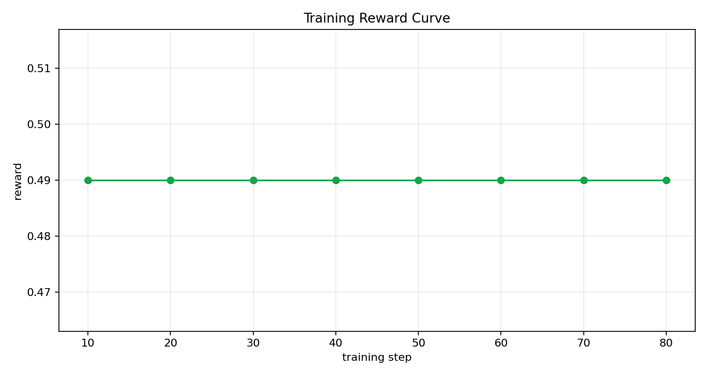

# Training Evidence Report

This report was auto-generated from a real environment-connected training run.

## Run Info

- Run directory: `artifacts\training_run`
- Total updates: `8`
- Final training step: `80`

## Metric Summary

- Initial loss: `10.787571`
- Final loss: `10.784626`
- Loss change (final - initial): `-0.002945`
- Best (lowest) loss: `10.784626` at step `80`

- Initial avg reward: `0.490000`
- Final avg reward: `0.490000`
- Reward change (final - initial): `0.000000`
- Best avg reward: `0.490000` at step `10`

## Curves

Loss curve (x-axis: `training step`, y-axis: `loss`):

Reward curve (x-axis: `training step`, y-axis: `reward`):

## Raw Metrics

Source file: `training_metrics.csv`
